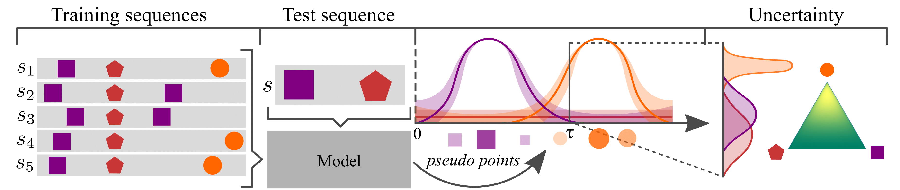

# Uncertainty on Asynchronous Time Event Prediction

This repository presents the experiments of the paper:

[Uncertainty on Asynchronous Time Event Prediction](http://papers.nips.cc/paper/9445-uncertainty-on-asynchronous-time-event-prediction.pdf)<br>
Marin Bilos, Bertrand Charpentier, Stephan Günnemann<br>
Conference on Neural Information Processing Systems (NeurIPS), 2019. *Spotlight talk*


## Usage
In order to train the models described in the paper:
```bash
python src/train.py
```
Parameters can be changed in `src/train.py`. Default parameters are:

```bash
## General config
model_name = 'dirichlet'      # ['gp', 'dirichlet', 'dpp']
dataset_name = 'random_graph' # ['mooc', 'random_graph', 'smart-home-A', 'stack_overflow']
max_epochs = 1000             # Maximum number of epochs
patience = 10                 # After how many iterations to stop the training
batch_size = 32               # How many sequences in each batch during training
rnn_hidden_dim = 64           # Size of RNN hidden state
mark_emb_dim = 64             # Size of input mark embedding vector
layer_hidden_dim = 64         # Size of a hidden layer that generates pseude points from RNN hidden state
n_layers = 2                  # Number of layers that generate points (for GP)
n_points = 20                 # Number of points to generate
n_samples = 10                # Number of samples to use in Monte Carlo estimations (if used)
alpha = 1e-3                  # Alpha regularization param (eq. 7)
beta = 1e-3                   # Beta regularization param (eq. 7)
lr = 1e-3                     # Learning rate of Adam optimizer
regularization = 1e-3         # L2 regularization

```

## Requirements
```
numpy=1.17.2
tensorflow=1.14.0
```
## Model Diagram
<div id="banner" style="overflow: hidden;justify-content:space-around;">
    <div class="" style="display: inline-block;">
        
    </div>
</div>

## Cite
Please cite our paper if you use the model or this code in your own work:

```
@incollection{NIPS2019_9445,
title = {Uncertainty on Asynchronous Time Event Prediction},
author = {Bilo\v{s}, Marin and Charpentier, Bertrand and G\"{u}nnemann, Stephan},
booktitle = {Advances in Neural Information Processing Systems 32},
editor = {H. Wallach and H. Larochelle and A. Beygelzimer and F. d\textquotesingle Alch\'{e}-Buc and E. Fox and R. Garnett},
pages = {12851--12860},
year = {2019},
publisher = {Curran Associates, Inc.},
url = {http://papers.nips.cc/paper/9445-uncertainty-on-asynchronous-time-event-prediction.pdf}
}
```
